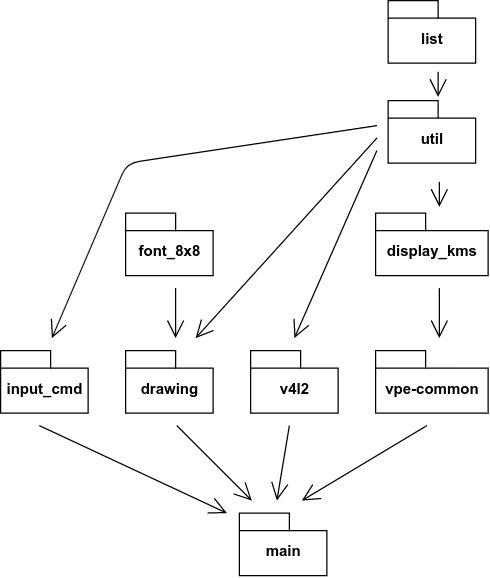

# 4_camera_vpe_edgedetect_disp

4_camera_vpe_edgedetect_disp와 6_camera_opencv_disp의 소스와 이에 대한 구조는 거의 같다. 따라서 그 둘의 설명 또한 OpenCV에 대한 일부 부분을 제외하면 모두 같다.

- 카메라로 영상을 읽어 직선을 추출하는 프로그램

## 용어의 기본 정의

### YUV 포맷

- https://en.wikipedia.org/wiki/YUV
- https://blog.dasomoli.org/265/
- https://seoduckchan.tistory.com/entry/yuv-color

 YUV 포맷은 컬러 이미지 파이프라인의 일부로 사용되는 색 인코딩 시스템으로, 빛의 삼원색을 표현하는 RGB와 달리 빛의 밝기를 나타내는 휘도(Y)와 색상 신호 2개(U, V)로 표현하는 방식이다. YUV를 사용하는 주된 이유는 RGB를 사용하는 방식에 비해 압축률을 크게 높일 수 있기 때문이다.

 YUV 포맷은 크게 Packed 포맷과 Planar 포맷으로 나뉠 수 있다.


1. Packed 포맷
   - Y, U (Cb), V (Cr) 성분이 함께 섞여 macropixel을 이루는 방식이다.
   - 주로 사용되는 종류에는 YUYV, UYVY 등이 있는데, Y성분 2개와 그 두 개 Y성분에 대한 U, V 성분을 합쳐 두개의 픽셀을 나타낸다.
   - YUYV 방식은 V422, YUNV, YUY2 로도 불리며, 32비트 안에 Y0, U0, Y1, V0 순서로 한 성분이 각각 8비트씩 저장되어 2개의 픽셀을 나타내게 된다.
   - UYVY 방식은 V422, YUNV, YUY2 로도 불리며, 32비트 안에 Y0, U0, Y1, V0 순서로 한 성분이 각각 8비트씩 저장되어 2개의 픽셀을 나타내게 된다.
   - YUYV 방식과 UYVY 방식 모두 8비트 기준으로 2개의 픽셀을 표현하려면 32비트가 필요하며, 이미지의 해상도가 W * H라면 Y는 W * H, U와 V는 각각 (W * H) / 2 만큼 필요하다.
1. Planar 포맷 
   - Y, U (Cb), V (Cr) 성분이 서로 다른 영역에 분리되어 저장되는 방식이다.
   - 주로 사용되는 종류에는 NV12, NV21 등이 있는데,  4 픽셀을 표현하기 위해 4개의 Y와 1개씩의 U, V가 필요하다.
   - 8비트를 기준으로 4픽셀을 표현하기 위해서는 48비트가 필요하며, W * H 해상도인 이미지를 표현하려면 Y는 W * H, U와 V는 각각 (W * H) / 4 만큼이 필요하다.


 main.c에서 영상을 캡쳐하는 데 UYVY 포맷을, VPE로 영상을 내보내는 데 NV12 포맷을 사용하고 있다.


### Dump

- https://m.blog.naver.com/PostView.nhn?blogId=on21life&logNo=221510758310&proxyReferer=https:%2F%2Fwww.google.com%2F

 Dump는 기억 장치의 내용을 기록한 데이터로, 프로그램 디버그 또는 시스템 테스트의 목적을 위해 기록되는 파일이다. 이 예제에서는 간선을 추출한 결과 이미지를 저장하는 것을 Dump로 명명한다.


### V4L2 (Video4Linux 2)

- https://en.wikipedia.org/wiki/Video4Linux

 V4L2 (Video4Linux 2)는 리눅스 운영체제에서 카메라를 통한 실시간 영상 촬영을 위한 드라이버와 API의 집합이다. V4L2는 리눅스 커널에서 기본적으로 지원하므로, 리눅스 시스템에서 비디오 촬영을 간단하게 구현할 수 있다.


### VPE (Video Processing Engine)

- http://software-dl.ti.com/processor-sdk-linux/esd/docs/latest/linux/Foundational_Components/Kernel/Kernel_Drivers/VPE.html
- https://www.ti.com/lit/ds/symlink/tda2p-acd.pdf?ts=1596210116924&ref_url=https%253A%252F%252Fwww.ti.com%252Fproduct%252FTDA2P-ACD
- https://www.encyclopedia.com/computing/dictionaries-thesauruses-pictures-and-press-releases/memory-memory-instruction

 VPE는 자동차의 임베디드 보드(TDA2Px ADAS)에서 지원하는 일종의 영상 처리 API로, 입력 버퍼에 대하여 디인터레이싱, 비율 조절, 색 반전 등의 작업을 할 수 있는 memory-to-memory API이다. 

 여기서 디인터레이싱이란 비월 주사 방식의 영상(아날로그 영상)을 비월 주사가 아닌 방식의 영상으로 변환하는 과정이고, memory-to-memory란 데이터를 특정 메모리에서 읽어 변환한 다음 다른 메모리에 옮기는 instruction의 종류이다.

### KMS (Kernel Mode Setting)

- https://prographics.tistory.com/1

 KMS는 DRM(Direct Rendering Manager)의 구성 요소로서 커널모드에서 그래픽 하드웨어 출력(해상도, color depths, memory layouts, refresh rate 등)에 대한 설정을 담당한다.

 여기에서 DRM은 디스플레이 컨트롤 드라이버이자, GPU 접근을 가능케하는 리눅스 서브 시스템이다. 즉, DRM는 GPU에 접근할 수 있는 그래픽 하드웨어를 제어하기 위한 커널 드라이버라고 할 수 있고, KMS를 비롯한 여러가지 User API를 제공한다.


## 파일 include 구조

 각 파일의 include 구조를 그림으로 나타내면 아래와 같다. 중복으로 include된 구조는 포함하지 않았다. (예를 들어, B가 A를 include 하고 C가 B를 include 하는데 동시에 C가 A를 include 하는 경우, C가 A를 include 하는 것은 의미가 없으므로 포함하지 않았다.)

<p align="center">
   </img>
</p>

## 각 파일에 대한 설명

### list.h

 C로 구현된 단순한 이중 연결 리스트이다.

### util.h / util.c

 DBG, MSG, ERROR와 같이 콘솔에 정해진 포맷으로 출력하는 함수를 제공하고, 디스플레이에 출력하기 위한 버퍼 구조체의 정의, 디스플레이의 업데이트 주기를 조정하기 위한 구조체의 정의 등 다른 기능을 구현하는데 필요한 기초적 자원을 제공한다.

#### buffer의 정의

 ```cpp
struct buffer {
    uint32_t fourcc, width, height;
    int nbo;
    struct omap_bo *bo[4];
    uint32_t pitches[4];
    struct list unlocked;
    bool multiplanar;   /* True when Y and U/V are in separate buffers. */
    int fd[4];          /* dmabuf */
    bool noScale;
};
```
- https://01.org/linuxgraphics/gfx-docs/drm/driver-api/dma-buf.html

 위 코드는 util.h에 포함된 buffer의 정의이다. 
 
 위 구조체에서  omap_bo는 디스플레이에 직접 연결된 DRM 버퍼로, 각 디스플레이에 한 윈소씩 대응된다.

 fd[4]는 DMA Buffer를 의미한다. dma-buf 서브 시스템은 하나의 하드웨어에 여러 드라이버와 서브 시스템이 접근할 수 있도록 해주는데, 이 서브 시스템은 단순히 하나의 GPU에 있는 버퍼를 다른 GPU로 복사해주는 방식으로 동작한다.

### display_kms.h / display_kms.c

 KMS API의 구현이다. DRM Plane에 대한 구조체 plane을 정의하고 있으며, 디스플레이를 제어하기 위한 구조체 display를 정의하고 있다. 추가적으로 디스플레이에 출력되는 데이터를 조작하기 위해 display 구조체에 접근하고 수정하는 여러 함수를 제공한다. 주로 display 구조체와 buffer 구조체를 수정하는 방식으로 이를 구현한다.

### vpe-common.h / vpe-common.c

 VPE API의 구현이다. vpe라는 구조체는 image_params 타입의 source로부터 destination으로 이미지를 변환하여 저장하는 방식으로 memory to memory API를 구현한다.

 여러 장치가 동시에 VPE를 사용하기 위해 VPE에 데이터를 queue하고 dequeue하는 함수가 제공된다.

### font_8x8.h
 
 각 문자를 디스플레이에 출력하기 위한 8*8 크기의 폰트를 정의한다.

### drawing.h / drawing.c

 프레임 버퍼에 사전에 정해진 포맷으로 점, 선, 문자, 문자열, 사각형을 그리는 기능을 제공한다. FrameBuffer라는 이름의 구조체에 디스플레이의 각 픽셀의 색상값을 저장하는 buf 변수가 있고, 도형을 그리는 함수들은 그 buf 변수를 수정한다.

### input_cmd.h

 StandbyInput이라는 이름의 단 하나의 함수만을 제공하는데, 콘솔로부터 한 문장이 입력될 때까지 대기하다가, 이를 읽어 char*로 반환한다.

### v4l2.h / v4l2.c

 V4L2 API를 활용하여 카메라의 입력 데이터를 읽는 API이다. 단순히 카메라의 데이터를 읽는 것 외에도 V4L2를 특정 포맷으로 열고 이를 닫는 함수, V4L2의 스트림을 켜고 끄는 함수, V4L2와 연결된 카메라에 버퍼를 queue하거나 dequeue하는 함수를 제공한다. 그리고 이전에 설명한 dma-buf 서브 시스템을 통해 버퍼를 공유할 수 있다.

### main.c

 main.c는 본격적으로 이전에 구현한 모든 API를 통해 카메라의 영상을 읽고 그 영상에서 직선을 추출한다.

 main.c는 크게 3개의 스레드로 구성되는데, capture_thread, capture_dump_thread, input_thread가 있다. 이들을 main 함수에서 생성하고 main 함수의 스레드는 pause한다.

 #### 스레드가 서로 통신하는 방법
  capture_dump_thread는 이름에서 알 수 있듯, 특정 명령이 콘솔로 들어오면 capture_thread가 읽은 데이터를 덤프해야 하므로, 복수의 스레드가 서로 데이터를 교환해야 하는 일이 생긴다. 이를 구현하는 데는 Linux의 메세지 큐 시스템을 사용한다.

  메세지 큐 시스템은 복수의 스레드가 데이터를 교환하기 위해 운영체제에서 지원하는 기능으로, 한 스레드가 특정 번호의 메세지 큐에 데이터를 queue하면 다른 스레드가 그 메세지 큐에 접근하여 데이터를 dequeue 할 수 있다.

  아래와 같은 라이브러리가 필요하다.
  ```cpp
#include <sys/msg.h> 
#include <sys/ipc.h> 
#include <sys/types.h>
  ```
  
  송신 스레드와 수신 스레드에서 주로 아래와 같은 3가지 함수를 이용할 수 있다.
  
  1. 메세지 큐 가져오기

      ```cpp
      int msgget(key_t key, int msgflg);
      ```
      특정 key에 해당하는, 운영체제에 존재하는 메세지 큐의 id를 가져오거나 새로 생성한다.

   1. 메세지 보내기

      ```cpp
      int msgsnd(int msqid, const void *msgp, size_t msgsz, int msgflg);
      ```
      특정 id의 메세지 큐에 msgsz 길이의 데이터를 추가한다. 데이터의 길이를 임의로 정할 수 있기 때문에 임의의 구조체에 대하여 메세지 큐 시스템을 이용할 수 있다.

   1. 메세지 받기

      ```cpp
      ssize_t msgrcv(int msqid, void *msgp, size_t msgsz, long msgtyp, int msgflg);
      ```
      특정 id의 메세지 큐에서 메세지를 하나 읽고 그 메세지를 큐에서 제거한다. 여기에서 msgtyp를 어떻게 지정하느냐에 따라, 큐에서 어떤 데이터를 읽어올지가 달라진다.


 - capture_thread
   - V4L2를 통해 카메라 이미지를 읽고 이를 VPE로 가공한 다음 Edge Detecton을 적용한다. 그 후 이미지를 DumpMsg 타입으로 메세지 큐에 보낸다.
 - capture_dump_thread
   - 메세지 큐에 데이터가 들어오는 것을 계속 기다리면서 데이터가 들어올 때마다 이를 로컬에 dump한다.
 - input_thread
   - 콘솔에서 dump 명령이 들어오는 것을 계속 기다리면서 명령이 들어오면 메세지 큐에 Dump Message를 보내 capture_dump_thread가 파일을 저장하게 한다.


#### main 함수의 동작
 main 함수는 다른 스레드가 공통적으로 사용하는 VPE와 V4L2를 open하고, tdata를 적절히 초기화한다. 그리고 capture_thread, capture_dump_thread, input_thread를 생성하여 인수로 thr_data를 넘겨준다. 그 이후 pause.

## 실행 결과
 카메라에 들어오는 이미지에서 직선 형태를 가진 부분을 추출하여 그 부분을 지나는 검은 직선을 그린다.