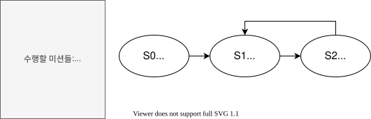

# 2020-07-26 회의록

## 결론
### 정기 회의 날짜
* 🗓 날짜: 매주 일요일 오후 1시
* ⏰ 시간: 팀원들 각자 사정 및 의제에 맞게 탄력 조정
* 🗺 장소: ZETIN 제 3동방

### 팀 메신저
* 잔디(JANDI) 메신저 사용 [(잔디 메신저 홈페이지)](https://www.jandi.com/l)
    * GitHub, Google Calendar 등 연동성이 높다.
    * 제안된 email이나 slack을 이용하는 것 보다 기능이 많다.
* Task나 공지사항을 기존에 이용하던 카카오톡보다 더욱 효율적으로 전달할 수 있다.

### 예제 코드 분석
* 각자 해야 할 일과 자세한 내용은 [Issue #2](https://github.com/shythm/eswcontest-car/issues/2)를 참고
* 각자 맡은 소스 코드
    * 권준호: `2_camera_vpe_dump_disp`
    * 김정현: `4_camera_vpe_edgedetect_disp`, `6_camera_opencv_disp`
    * 박재선: `3_camera_overlay_draw_disp`
    * 이성호: `5_opencv_disp` 
    * 이준서: `0_control_sensor_test`, `1_camera_dump_disp`
* 마감일
    * 2020년 8월 1일(토요일)까지 예제코드 분석
* 발표일
    * 2020년 8월 2일(일요일, 정기 회의날)
    * Google Hangout이나 Google Meet 사용

### 포맥스 판 주문하기
* 회의 내용
    * 방의 여유 공간이 약 250x400이라 이에 맞게 적당한 크기의 포맥스를 구매해야 함
    * 찍찍이로 구조물을 탈부착식으로 만들어 남는 공간을 활용하자
    * 정사각형이든 직사각형이든 단위 포맥스를 주문해서 원하는 크기로 맵을 만들어 굴려볼 수 있게 하자
    * 각 단위 포맥스를 이어 붙이면 울퉁불퉁한 면이 생길 수 있기 때문에 최대한 단위 면적이 큰 포맥스를 구매하자
* 제원
    * 크기: 가로 70cm 세로 70cm
    * 색상: 검은색
    * 두께: 2T
    * 개수: 12장
* 동아리 연합회 예산 사용 설명서를 참고해서 시장 복명 조사서 제출하기

### 1차 Mission
* 기한: 완성할 때까지 매일 저녁 7시에 모이기
* 인원: 김정현, 박재선, 이성호, 이준서
* 목표
    * 부팅 후 프로그램 자동 실행
    * 카메라 이용 특정 물체 인식 후 화면에 인식 결과와 연산 시간 표시
    * 차량이 인식한 물체 따라가게 하기

### State Machine 의존성 설계
* 회의 내용
    * 인식 단계와 제어 단계의 기능(예를 들어 차량의 position, 우선정지 장애물 거리 등을 반환하는 기능)을 서로 의존성이 없게끔 구현해야 한다.
    * 그러기 위해서는 이러한 기능들을 사용할 처리 단계 FSM의 state가 무엇이 있나 조사해야 한다.
    * 도로 주행, 우선정지 장애물, 오르막, 고가도로, 교차로(로터리), 터널, 추월 구간, 신호등, 주차 총 9개의 state가 조사되었다.
    * 한편, 대기(S0)->도로 주행(S1)->미션 검사(S2)->미션 수행(S3)->미션 종료(S4) FSM 구조에서 도로 주행(S1) state을 미션 수행(S3)에 포함시켰고, 미션 종료(S4) state가 굳이 필요없다고 판단해 없애기로 했다.
        * 도로 주행(S1)을 미션 수행(S3)에 포함시키기로 한 이유: 도로 주행도 하나의 미션으로 볼 수 있기 때문이다. 따라서 미션 검사(S2)에서 도로 주행 외에 아무런 미션이 없으면 미션 수행(S3)의 도로 주행 미션으로 넘어가 도로 주행을 처리하기로 한다.
        * 미션 종료(S4)를 없애기로 한 이유: 본래의 목적은 다시 도로 주행(S1, 이제 없어졌지만)으로 넘어가기 전 원할한 도로 주행을 위해 각종 변수들(예를 들어 속도)을 재정비하는 목적이 있었다. 하지만 따로 미션 종료(S4)가 필요없다고 판단하고 필요하다면 미션 수행(S3)에서 하는 것이 옳다고 판단하여 미션 종료(S4)를 삭제하게 되었다.
    * 수정된 FSM의 구조
    
    * **해야 할 일: 각자 맡은 미션 state에 대해 어떤 기능이 필요한지 조사하기.**
        * 기한: 2020년 8월 2일(일요일, 정기 회의날)
        * 각자 맡은 미션
            * 권준호: 도로 주행, 고가 도로
            * 김정현: 교차로(로터리), 신호등
            * 박재선: 우선정지 장애물, 터널
            * 이성호: 오르막, 주차 구간
            * 이준서: 추월 구간
        * 기능이 어떤 입력을 받고 어떤 출력을 하는지 상세히 명시할 것
        * 각자 해당 미션을 어떻게 수행할 지 생각해야 어떤 기능이 필요할 지 알 수 있다.